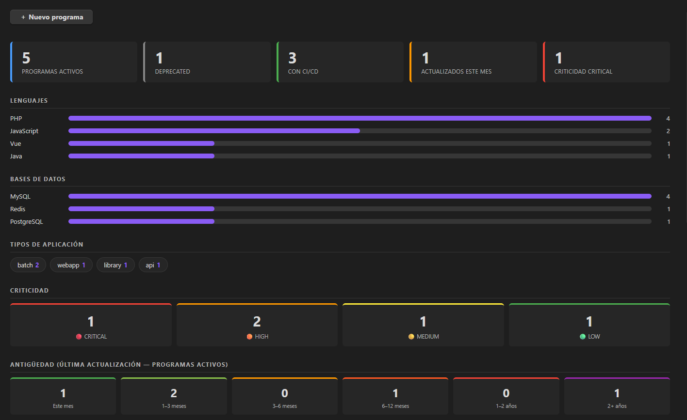
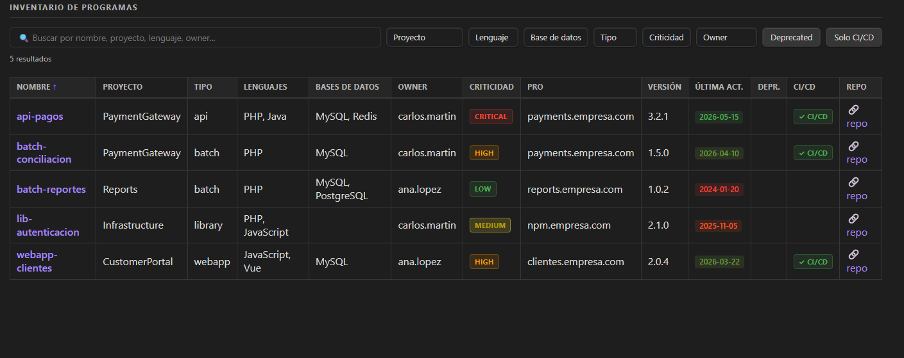

# OBSIDIAN_DEV_INVENTORY

> Vault de Obsidian para llevar el inventario centralizado del software de empresa: aplicaciones, APIs, batches y librerías, con dashboard interactivo, KPIs y búsqueda en tiempo real.

---

## Screenshots

---

## Configuración

1. Abre el vault en Obsidian (`Archivo → Abrir vault → selecciona esta carpeta`).
2. Instala los plugins de comunidad requeridos:
   - **Dataview** — activa *JavaScript Queries* en sus ajustes.
   - **Templater** — establece esta carpeta como carpeta de plantillas.
3. Ve a `Ajustes → Apariencia → Fragmentos CSS` y activa **devinventory**.
4. Abre [`_SETUP.md`](_SETUP.md) para la guía completa de instalación paso a paso.

## Uso

- El dashboard principal es [`index.md`](index.md) — ábrelo en modo lectura.
- Pulsa **＋ Nuevo programa** para registrar una nueva aplicación mediante formulario.
- Usa el buscador y los filtros desplegables para localizar cualquier programa.
- Cada programa tiene su propia nota con metadatos YAML, entornos (DEV / PRE / PRO) y comentarios.
- Consulta [`_GUIA_DATOS.md`](_GUIA_DATOS.md) para la referencia completa de todos los campos.

---

## Documentación técnica

Para entender cómo está construido el vault a nivel de código — estructura DataviewJS, lógica del dashboard, sistema de plantillas y CSS — consulta la guía técnica:

📄 [`TECHNICAL.md`](TECHNICAL.md)

---

Desarrollado por [caldev](https://github.com/caldeix) ❤️ · [GitHub](https://github.com/caldeix) · [ME](https://caldeix.github.io/me/)

